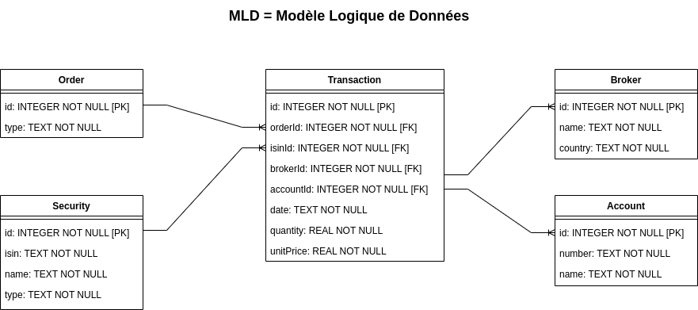

# Dashboard Listing Securities

[

This project is inspired by this video tutorial: 
- [Youtube video](https://www.youtube.com/watch?v=GSHFzqqPq5U).

## Table of Contents

1. [Introduction](#introduction)
2. [Stack Used](#stack-used)
3. [Architecture](#architecture)
4. [Features](#features)
4. [Methods](#methods)
5. [Usage](#usage)
6. [Contributing](#contributing)
7. [License](#license)

## Introduction

A real-time stock price tracker is a tool that provides immediate updates on stock prices as they fluctuate throughout the trading day. It offers users current market data, including bid and ask prices, trading volume, and price changes. 

## Stack Used

This project was built using the following technologies:

1. Frontend:
    - Streamlit

2. Middleware:
    - FastAPI

3. Backend:
    - csv # TODO: Update with a database server
    - SQLite

3. Other tools:
    - Git
    - GitHub
    - Visual Studio

## Architecture

1 - DataBase (Logical Data Model)

2 - Application

## Features

1. Compute risk-adjusted return:
    - Sharpe ratio
    -

2.

## Methods

### Method 1: BeautifulSoup and Requests

This method utilizes the popular BeautifulSoup library for parsing HTML and the Requests library for making HTTP requests. It is a simple and effective approach for extracting data from static web pages.

### Method 2: Scrapy

Scrapy is a robust and extensible web scraping framework. It provides a complete solution for crawling websites and extracting structured data. This method is suitable for handling complex scraping tasks and building scalable spiders.

## Usage

To use any of the provided methods, follow the instructions provided in the respective method's directory. Each method comes with a dedicated README to guide you through the implementation.

## Contributing

If you have improvements or new methods to add, follow these steps:

1. **Fork the Repository**: Click "Fork" to create a copy in your GitHub account.

2. **Clone the Forked Repository**: Use `git clone` to get a local copy.

3. **Create a New Branch**: Make a new branch for your changes.

4. **Make Changes**: Add or modify code, documentation, etc.

5. **Commit Changes**: Commit with a clear message.

6. **Push Changes**: Push to your forked repo.

7. **Create a Pull Request (PR)**: Open a PR from your branch to the main repo.

Feel free to contribute and make this project even better! 

## License

This project is licensed under the [MIT License](https://github.com/git/git-scm.com/blob/main/MIT-LICENSE.txt), making it open for collaboration and use in various projects.